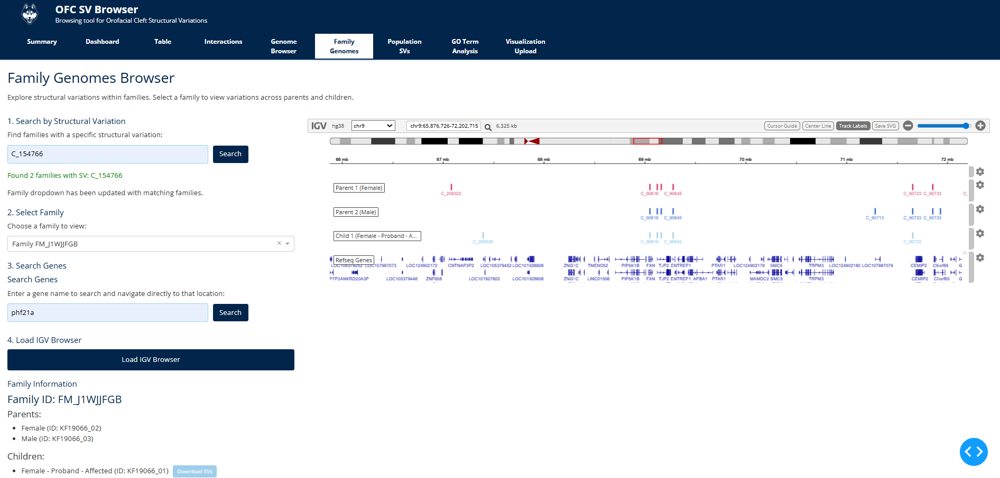
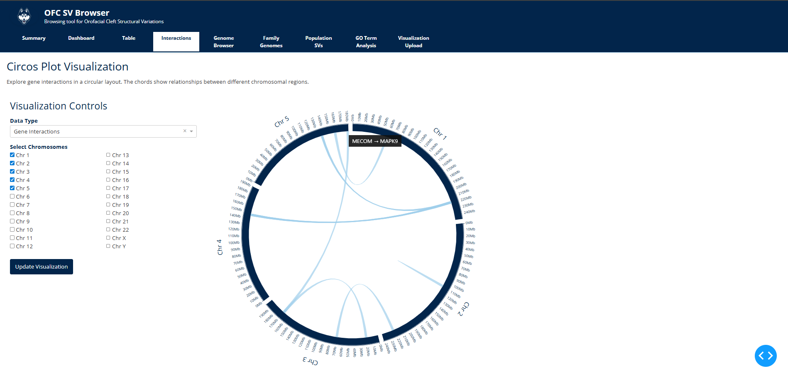
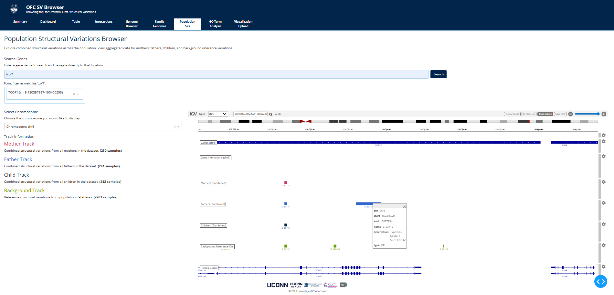
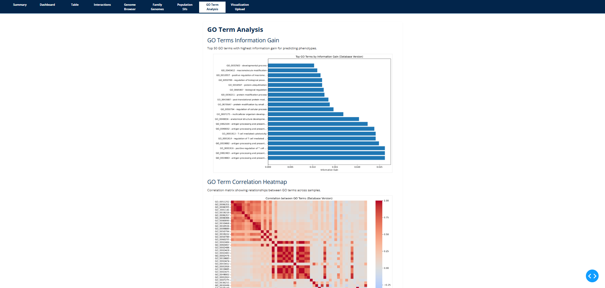

# OFC-SV Explorer

Research dashboard hosted on UConn infrastructure for exploring structural variants in the Kids First orofacial cleft cohort. Internal-only access; intended for collaborative analysis by the research team.

## What it does
- Visualizes family and population SVs with IGV.js tracks
- Surfaces long-range gene interactions and inheritance patterns
- Summarizes cohort-wide frequencies and cell-type regulatory context
- Runs information gain scoring to spot informative GO terms

## Running it
1) Python 3.8+ with the cohort SQLite at `/data/cellvar.db/cellvar.db` (adjust in `utils/database.py` if needed).
2) Install deps:
```bash
pip install -r requirements.txt
```
3) Start the app:
```bash
python run.py
```
Serves on http://localhost:8002 (internal network / UConn host).

## AI Query indexes
To speed up AI Query intent templates, create the recommended indexes:
```bash
sqlite3 /data/cellvar.db/cellvar.db < scripts/create_ai_query_indexes.sql
```

## Screenshots (local only)
- Family genomes: trio SV tracks with shared and proband-specific events.  


- Interactions: long-range gene interaction arcs layered over SVs.  


- Population view: cohort frequencies and per-chromosome SV burden.  


- GO / information gain: top GO terms ranked by information gain on SV presence.  


## Repo layout (quick reference)
- `app.py`, `index.py`, `run.py`: app bootstrap and routing
- `components/`: shared Dash components
- `pages/`: page layouts (family, population, interactions, GO)
- `assets/`: static data and styles
- `utils/`: helpers for data access and styling

## Notes
- Hosted on a UConn server; keep data and access within institutional network.
- Update database path or port via `utils/database.py` and `run.py` as needed.
