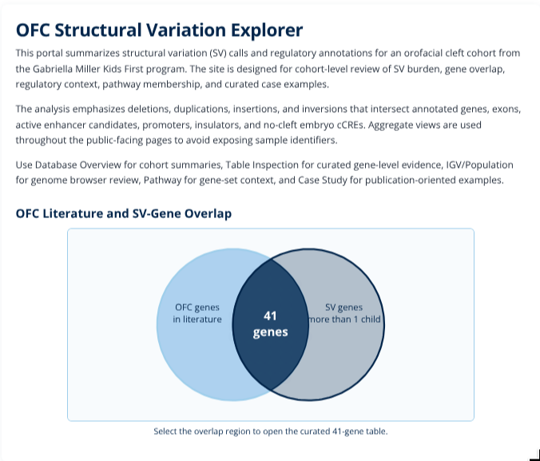
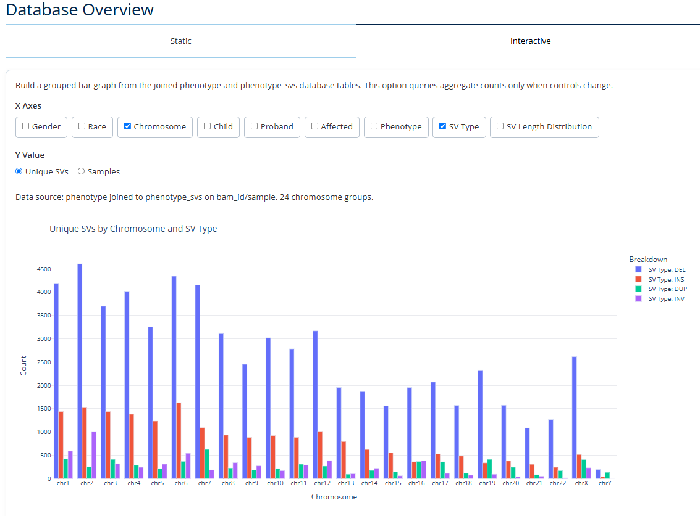
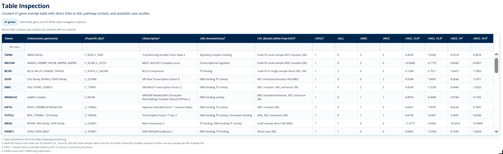
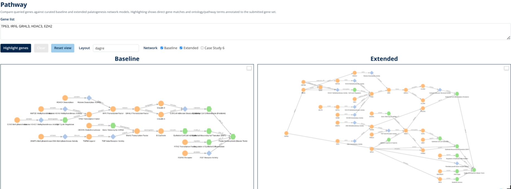
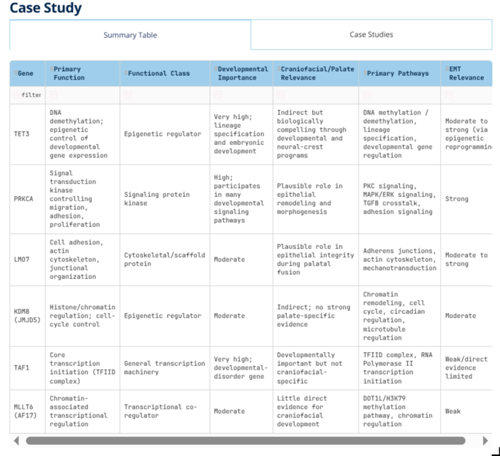

# OFC SV Explorer

OFC SV Explorer is a web portal for reviewing structural variation in an orofacial cleft research cohort. It brings together cohort-level summaries, a curated gene table, IGV-based locus review, pathway networks, and selected case studies in one interface.

## Links

- Web portal: https://ofc-sv.cse.uconn.edu/
- Screenshot gallery: https://github.com/DopeMeerkat/ofc-svexplorer/blob/prod/gallery.md
- Source code: https://github.com/DopeMeerkat/ofc-svexplorer/tree/prod

## Data Scope

The portal is backed by a local research database built for OFC structural variant analysis. It includes cohort phenotype summaries, structural variant calls, gene and exon coordinates, SV-gene overlap records, and regulatory annotations such as active enhancer candidates, promoter candidates, insulator candidates, and no-cleft embryo cCREs.

Production views are designed to avoid exposing individual sample identifiers. The main outputs are aggregate counts, genomic intervals, summary tables, and curated case-study evidence.

## Summary

The Summary page is the entry point for the site. It introduces the cohort analysis and highlights overlap between known OFC genes and genes with recurrent SV signal in the cohort.



Use this page to:

- Review the high-level purpose of the portal.
- Identify the overlap between literature-supported OFC genes and cohort SV findings.
- Open the curated 41-gene table by selecting the overlap region.

## Database Overview

The Database Overview page summarizes the contents of the database through charts and compact tables. It has two tabs: Static and Interactive.



Use the Static tab to review:

- Cohort-level counts for families, samples, affected cases, parents, controls, unique SVs, genes, and regulatory elements.
- SV distributions by type, chromosome, length, and genomic region.
- Cohort breakdowns by phenotype and related categories.
- SV-GF overlap per person, where genomic feature overlap summaries are normalized across the cohort.

Use the Interactive tab to build custom aggregate bar graphs:

- Select one or more grouping options, such as Chromosome and SV Type.
- Choose a value to summarize, such as Unique SVs or Samples.
- Use the generated chart to compare distributions across selected categories.

## Table Inspection

The Table Inspection page presents the curated 41-gene overlap table. It is intended for moving from a summary gene list into locus- and pathway-level review.



Use this page to:

- Sort and search the curated table.
- Review gene annotations, candidate SVs, expression columns, and supporting context.
- Select clickable Gene or FusorSV ID fields to open navigation options.
- Open supported entries in IGV/Population, Pathway, or Case Study views.

## IGV/Population

The IGV/Population page supports locus-level review of aggregate structural variant tracks. It is the main genome-browser view in the production site.


- Search for a gene and jump directly to its genomic locus.
- Browse by chromosome when reviewing broader regions.
- View aggregate SV tracks across the cohort.
- Add optional annotation tracks, including exons, active enhancer candidates, promoter candidates, insulator candidates, and no-cleft embryo cCREs.

Note: When opening a gene or SV from search or a link, the viewer focuses on that region and nearby context for optimization. Use the flanking-window control if you want to see a wider area around a selected SV.

## Pathway

The Pathway page compares a user-entered gene list against curated palatogenesis network models.



- Select `Highlight genes` to mark matching genes and annotated pathway terms.
- Show or hide the Baseline, Extended, and Case Study 6 network views.
- Click nodes to inspect labels, identifiers, and annotations.

## Case Study

The Case Study page contains curated gene-level examples. Each case connects a selected gene to cohort findings, genomic context, pathway interpretation, and supporting literature.



Use this page to:

- Review the case-study summary table.
- Select a curated case study from the dropdown.
- Read the gene function, IGV, literature, pathway, and supporting-data sections.
- Follow embedded links to the IGV/Population and Pathway pages.

## Citation


```bibtex
@article{ofc_sv_explorer,
  title = {OFC SV Explorer: an interactive portal for orofacial cleft structural variation analysis},
  author = {TBD},
  journal = {TBD},
  year = {TBD},
  doi = {TBD}
}
```

## Acknowledgements

This project was developed at the University of Connecticut for research use in orofacial cleft structural variation analysis.
