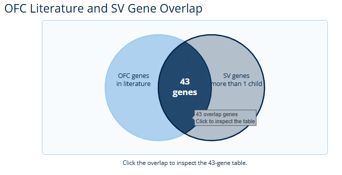
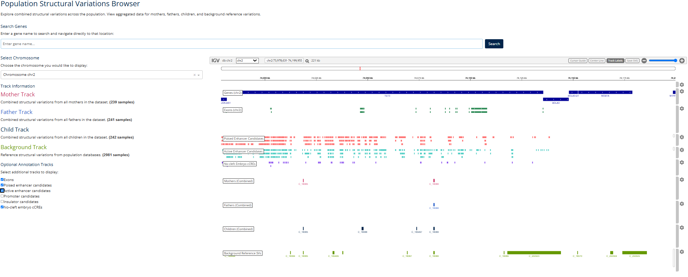

# OFC SV Browser

OFC SV Browser is a web portal for exploring structural variation in an orofacial cleft cohort. It combines database summaries, searchable gene tables, an IGV-based genome browser, and pathway-level analysis in a single interface. The idea is to let you go from cohort-level numbers to locus-level and pathway-level interpretation without writing database queries yourself.

This guide walks through each page and how to use it. The images are placeholders for now; final screenshots will be added here.

## Web Link

http://ofc-svexplorer.cardinal.engr.uconn.edu/


## Data

The browser is backed by a local SQLite database built from the Kids First OFC cohort. It stores:

- Cohort phenotype records
- Structural variant calls: deletions, duplications, insertions, and inversions
- Gene and exon coordinates
- Precomputed SV-gene overlap records
- Candidate regulatory regions (enhancers, promoters, insulators) and no-cleft embryo cCREs

Public views on the site use aggregate counts and genomic coordinates, so individual samples are not exposed.

## Summary

The Summary page introduces the project and shows a Venn-style overlap of OFC literature genes against genes that carry SVs in more than one child. Click the center overlap region to open the 41-gene table on the Table Inspection page.



This is a good entry point if you want to see which known OFC genes also carry SV signal in the cohort.

## Database Overview

The Database Overview page has two tabs:


**Static tab**: shows precomputed summary metrics. It covers total SV counts, per-type statistics, distributions by chromosome and length, cohort breakdowns, and gene/exon counts per chromosome.


**Interactive tab**: build your own aggregate bar graph from the cohort tables. Pick an X-axis category such as chromosome, SV type, or phenotype; choose a Y value (Unique SVs or Samples); and optionally add a second category to produce grouped bars.

For example, set X-axis to Chromosome, Y value to Unique SVs, and add SV Type as the second category. This gives you a per-chromosome breakdown of SV types in one chart.

## Table Inspection

The Table Inspection page holds the curated 41-gene overlap table. You can sort by any column and filter rows with the built-in controls. Clicking a value in a Gene or FusorSV ID(s) column opens a small menu with options to open that item in the IGV browser or the Pathway page.


## IGV Browser (Population)

The Population page is the genome browser. It shows aggregated structural variant tracks for the cohort, and you can layer annotation tracks on top.



**How to use it:**

- Search for a gene to jump straight to its locus.
- Pick a chromosome from the dropdown if you prefer to browse manually.
- Choose the annotation tracks you want under Optional Annotation Tracks:
  - Exons
  - Poised enhancer candidates
  - Active enhancer candidates
  - Promoter candidates
  - Insulator candidates
  - No-cleft embryo cCREs

A gene search sets the view to the gene interval and loads the annotation tracks that overlap that region. Coming from the Table Inspection page, the locus is loaded for you automatically.

## Pathway

The Pathway page lets you compare a list of genes against a curated palatogenesis pathway network.


**How to use it:**

- Enter genes as a comma-separated list, for example `TP63, IRF6, GRHL3`, or upload a CSV containing gene symbols.
- Click Analyze to highlight the matching network nodes.
- Show or hide the Baseline, Extended, and Case Study 6 network versions, and pick a layout that is easy to read.
- Click a node to inspect its details, and check the hit summary for genes that were not found in the network.
- The GO term enrichment table below ranks enriched terms; sorting by q-value brings the strongest signal to the top.

## Case Study

The Case Study page walks through curated examples that connect a specific gene to the cohort findings. For each case it explains the gene's function, links to the IGV view, summarizes the relevant literature, and lists supporting evidence such as overlaps with exons, enhancer/promoter candidates, and expression levels in a compact table.


The featured case is currently TET3.

## Citation

Citation details will be added once the companion publication is available.

```bibtex
@article{ofc_sv_browser,
  title = {OFC SV Browser: an interactive web portal for orofacial cleft structural variation exploration},
  author = {TBD},
  journal = {TBD},
  year = {TBD},
  doi = {TBD}
}
```

## Acknowledgements
